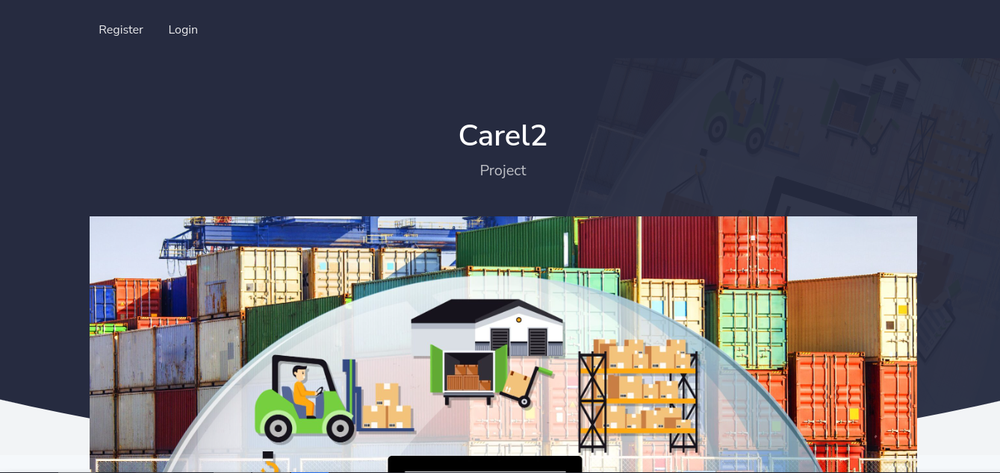
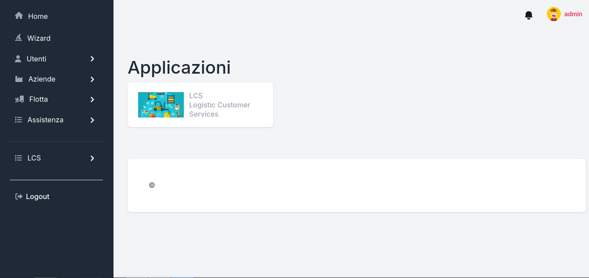
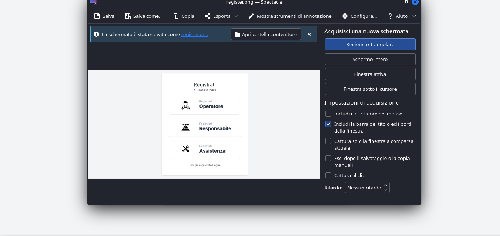
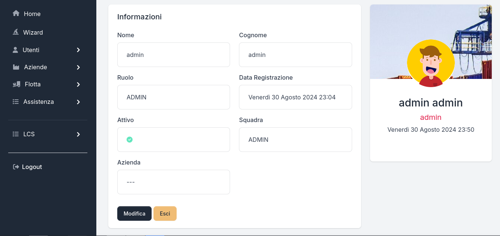
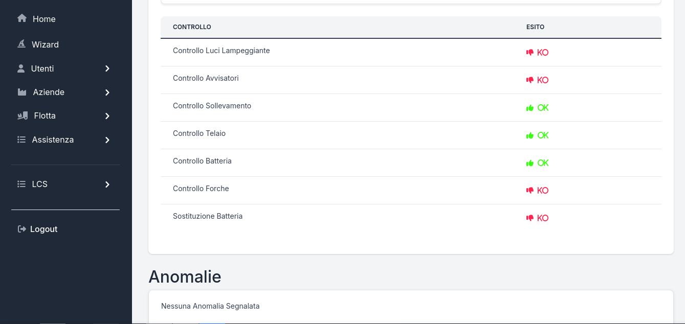

# Django Carel2 Project

## Installation and Run

* Create Virtual environment
  
  ```
  git clone https://github.com/anideb1975/carel2.git
  ```
  ```
  cd carel2
  ```
  ```
  python -m venv env
  ```
- or
    
  ```
  virtualenv env
  ```
  ```
  source ./env/bin/activate
  ```
  ```
  pip install -r requirements.txt
  ```

* Create database
 ```
cd core
 ```
```
python manage.py makemigrations
```
```
python manage.py migrate
```

* Create superuser
```
python manage.py createsuperuser
```

* Run the application
```
python manage.py runserver
```

- Access
  - First login only super user
- Add account
  - select register in your index page
  - create appropriate level for account
  - note application multilevel and multiuser with various role and access

* Database
  - development version use sqlite3
  - you can change database edit settings.py and configure your preferred db example mysql or mariadb postgresql

* Production
  - remember run
 ```
python manage.py collectstatic
```

## Authors

anideb1975


## Help

Any advise for common problems or issues.


## License

This project is licensed under the  GPL License - see the LICENSE.md file for details

## Version History

* 1.0
    * Initial Release










